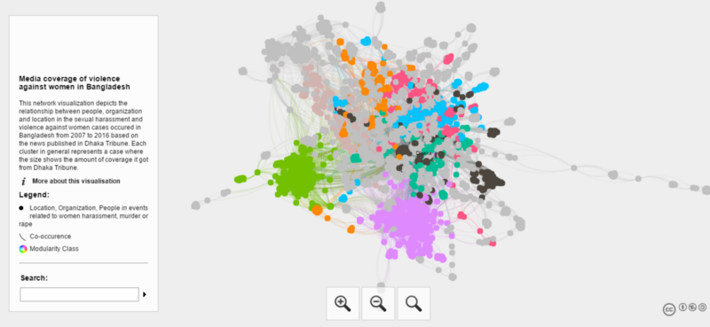

# Dhaka_Tribune-Network-Visualization

This project explore the media coverage on the articles about harassment or violence against women, including rape and murder related cases. This project was done with the help of KolpoKoushol , an initiative by former MIT alumni’s of Bangladesh to gather people from many fields for learning about interdisciplinary ideas.

### Interactive Network Link : 

[Media Coverage of Violence Against Women in Bangladesh](https://tahsin-mayeesha.github.io/Dhaka_Tribune-Network-Visualization/#)

### Network Structure Visualiation : 

 

This project has been featured by [Fast.ai](fast.ai)

See : [Deep Learning, Not just for Silicon Valley](http://www.fast.ai/2017/02/27/not-just-silicon-valley/)
